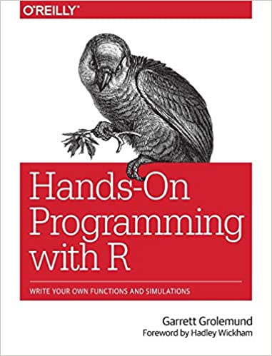

--- 
title: "PRECODE ESR Bioinformatics Course"
author: "Peter J. Bailey"
date: "`r Sys.Date()`"
site: bookdown::bookdown_site
output: bookdown::gitbook
documentclass: book
bibliography: [book.bib, packages.bib]
biblio-style: apalike
link-citations: yes
github-repo: rstudio/bookdown-demo
description: "Basic introduction to RNAseq analysis using R/Bioconductor"
---

# Prerequisites


This book provides an introductory course in R programming. It is primarily designed to provide a foundation for bioinformaticians and wet lab biologists to develop core skills for the analysis of Next Generation Sequencing (NGS) analysis. 


The book is written in [RMarkdown](https://rmarkdown.rstudio.com) with [bookdown](https://bookdown.org).


## Installing R and RStudio

<a href="https://www.amazon.com/Hands-Programming-Write-Functions-Simulations/dp/1449359019"></a>

To complete this course you will need to install [R](https://cloud.r-project.org/) and [RStudio](https://rstudio.com/) on your local machine. Detailed instructions on how to install R and RStudio are provided in [__"Hands-on programming with R"__](https://rstudio-education.github.io/hopr/starting.html).


[__Hands-on programming with R__](https://rstudio-education.github.io/hopr/) is an excellent open source reference for learning the basics of R and can be used as a companion to this course.


[__RStudio__](https://rstudio.com/) is an integrated development environment (IDE) for R. It includes a console, syntax-highlighting editor that supports direct code execution, as well as tools for plotting, history, debugging and workspace management.

```{r layout, echo = FALSE, fig.cap = "The RStudio IDE for R."}
knitr::include_graphics("images/hopr_aa01.png")
```

```{block2, r_version, type='rmdimportant'}
**Please install the latest R release (2020-10-10, Bunny-Wunnies Freak Out).**
```

## Installing R and Bioconductor packages

Once you have R/RStudio up and running please also install Bioconductor. Bioconductor is a repository of R packages 

Bioconductor can be installed easily using the following script:

```{r eval=FALSE}
if (!requireNamespace("BiocManager", quietly = TRUE))
    install.packages("BiocManager")
BiocManager::install(version = "3.12")

```

Individual packages of interest can then be installed as follows:

```{r eval=FALSE}
BiocManager::install("DESeq2")
```

To view documentation about the installed package you can use the following R function:

```{r eval=FALSE}
browseVignettes("DESeq2")
```


## Bioconductor packages used in this course

The following Bioconductor packages _must_ be installed to complete this course. Please use the following code to bring your R environment up-to-date:


```{r eval=FALSE}
BiocManager::install(c("DESeq2", "ggpubr", "ComplexHeatmap",
                       "circlize", "clusterProfiler"))
```


## Learning resources

There are a multitude of learning resources for the R programming language. Here are just a few noteworthy examples:


```{r include=FALSE}
# automatically create a bib database for R packages
knitr::write_bib(c(
  .packages(), 'bookdown', 'knitr', 'rmarkdown', 'DESeq2', "ggpubr", "ComplexHeatmap",
                       "circlize", "clusterProfiler"
), 'packages.bib')
```
